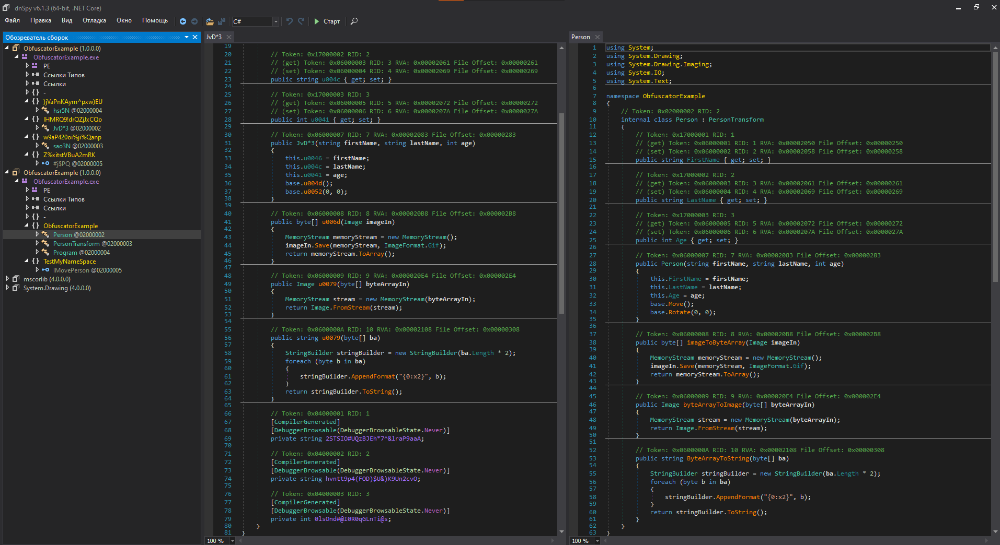

# ObfuscatorExample

## Пример обфускации кода
---
В данном примере используется библиотека 
[Mono-Cecil](https://www.mono-project.com/docs/tools+libraries/libraries/Mono.Cecil/)
Проекта *Mono-project*


В примере реализованы бызовые фунцкии переименования 

```csharp
//ReadAssembly(PATH_TO_NET_FILE)
AssemblyDefinition asm = AssemblyDefinition.ReadAssembly("ObfuscatorExample.exe");

foreach (TypeDefinition t in asm.MainModule.Types)
            {
             //rename nested types
             foreach (var nestedType in t.NestedTypes)
                 nestedType.Name = RandomString(nestedType.Name.Length);
                    
             asm.Write("ObfuscatorExample_obfuscate.exe");
            }
```


Результатом работы 



---
